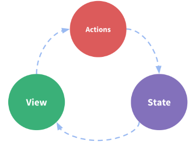

# OpenPaaS Dashboard
### Live coding a new widget with Vue.JS
---

1. Overview
2. Widget API
3. Creating a new widget

---

## Overview


---

1. The OpenPaaS Dashboard is a [VueJS](https://vuejs.org)-based application which provides a set of pages composed of widgets
2. A widget is an independant UI component <!-- .element: class="fragment" -->
3. The user can add as many widgets as he wants to his pages from a "widget store" <!-- .element: class="fragment" -->
4. Widgets can be ordered with drag and drop <!-- .element: class="fragment" -->

---

### Technology

- [VueJS](https://vuejs.org) as the frontend framework
- [Muuri](https://haltu.github.io/muuri/): Responsive, sortable, filterable and draggable grid layouts
- [Vuetify 1.5.x](https://v15.vuetifyjs.com/en/) as the Material UI library
- [OpenPaaS Platform](https://open-paas.org): Identity, social APIS, etc...

---

### Widgets are avaible in a "Store"


----

## Available widgets 1/2

- OpenPaaS Email
- OpenPaaS Calendar
- OpenPaaS Contact
- OpenPaaS Member
- OpenPaaS Application List
- Github
- Hackernews

----

## Available widgets 2/2

- Clock
- Cryptocurrency
- Google News
- RSS Reader
- Tuleap Projects
- Twitter mentions
- Weather

---

## Widget API

---

### Import & Tell Vue

`vue-dashboard` ~~is~~ will be a Vue plugin (**adds global-level functionality to Vue**) which allows to add dashboards to your Vue application 'without' effort.

```js
import VueDashboard from "vue-dashboard";

Vue.use(VueDashboard, {
  store,  // your vuex store instance (required)
  widgets // array of widgets to be used by the dashboard
});
```

---

### Use component

```html
<template>
  <dashboard-card-grid :cards="cards"/>
</template>

<script>
export default {
  name: "home",
  computed: {
    cards() {
      // TODO: Defines you cards here
    }
  }
};
</script>
```

---

Widgets must follow the `Widget Component API`

``` js
export default {
  type,        // String, unique
  title,       // String
  icon,        // String
  description, // String
  categories,  // [String]
  store,       // Vuex module
  components,  // Main & Settings Vue components
  hooks,       // lifecycle functions
  settings     // Map
}
```

----

### `type`

- The widget type as `String`
- This MUST be unique among all widgets

----

### `title`

- The widget title as `String`
- Used as display name in the widget store

----

### `icon`

- The widget icon as `String`
- Possible values are icon names from [material.io icons](https://material.io/resources/icons/)
- Used in the widget store

----

### `description`

- The widget description as `String`
- Used to display a short description of the widget in the widget store

----

### `categories`

- An array of String
- Categories are used in the store to filter and find widgets.

----

### `store`

A [vuex store module](https://vuex.vuejs.org/guide/modules.html) which is defined to be used by the widget only

----

### `components`

- Hash of components used to build the UI.
- `main` component (**required**) is the one displayed in the card by default.

```js
{
  main: {
    component: VueComponent,    // the Vue component
    title: "Display Title",     // the title of the component
    color: "blue"               // the widget background color
  }
}
```

----

### Settings `component`

- `settings` component (**optional**) is the one used to display the widget settings.

```js
{
  settings: {
    component: VueSettingsComponent // a Vue component which handles the settings of the widget
  }
}
```

----

### `hooks`

- Hash of functions used on widgets lifecycles
- `onRemove` is called when the card containing the widget is removed from the grid

``` js
onRemove: store => {
  // do something
}
```

----

### `settings`

- Hash of settings for the component.
- `data`: Hash of settings to be used by the widget. The settings are then available on the `settings` `props` of the Vue main component
- `validate(settings)`: A function which returns `true` if settings are valid, `false` otherwise
- Settings are saved on the OpenPaaS backend

---

## Let's code!

1. Follow the `Widget API`
2. Follow a simple file structure: Widgets are automatically "instanciated" at startup

---

### "helloworld" widget

---

1. Create a new folder `helloworld` under `src/components/widgets`

---

2. Create your hello world widget as a Vue SFC component in `src/components/widgets/helloworld/`. Let's name it `HelloWorld.vue`

```html
<template>
  <div class="hello">
    <span class="title white--text pb-4">Hello {{ name }}</span>
  </div>
</template>

<script>
export default {
  data() {
    return {
      name: "Dashboard",
    };
  }
};
</script>

<style scoped>
.hello {
  display: flex;
  justify-content: center;
}
</style>
```

---

3. Add an `index.js` file in `src/components/widgets/helloworld` which exports your widget like

```js
import HelloWorld from "./HelloWorld.vue";

export default {
  type: "openpaas.dashboard.helloword",
  title: "My HelloWorld Component",
  icon: "access_time",
  categories: ["hello"],
  description: "This is my most famous component",
  components: {
    main: { component: HelloWorld, color: "purple" }
  }
};
```

---

The new widget is then available in the widget store, you can add it to any dashboard instance.


---


----

You can also add it multiple times


---

### A bit "more complex": Todo widget


---

#### Steps

1. Create the TODO widget with Vuetify components
2. Add Vuex state management
3. Connect to OpenPaaS API

---

#### Step 1: TODO widget

1. Follow the same steps as for the HelloWorld component...
2. Use Vuetify components: `<v-list>`, `<v-checkbox/>`, `<v-text-field/>`
3. Add some Vue magic

---

#### List display

```html
 <v-list two-line dense>
  <v-list-tile v-for="(todo, index) in todos" :key="todo._id">
    <v-list-tile-action>
      <v-checkbox v-model="todo.done"></v-checkbox>
    </v-list-tile-action>
    <v-list-tile-content>
      <v-list-tile-title class="title" :class="{ 'done' : todo.done }">{{ todo.title }}</v-list-tile-title>
      <v-list-tile-sub-title>{{ todo.created_at | moment("from") }}</v-list-tile-sub-title>
    </v-list-tile-content>
    <v-list-tile-action>
      <v-btn icon ripple @click="remove(index)">
        <v-icon color="grey lighten-1">clear</v-icon>
      </v-btn>
    </v-list-tile-action>
  </v-list-tile>
</v-list>
```

---

```js
export default {
  data: () => ({
    todos: []
  }),
  methods: {
    remove(index) {
      console.log("Remove", index);
      this.todos.splice(index, 1);
    }
  }
  mounted() {
    this.todos = [
      { _id: 1, title: "Buy 🍺", created_at: Date.now(), done: false},
      { _id: 2, title: "Adopt a 🦊", created_at: Date.now(), done: true },
    ];
  }
}
```

---

#### Input field

```html
<v-text-field
  label="Add a todo"
  v-model="todo"
  v-on:keyup.enter="addTodo"
></v-text-field>
```
---

```js
data: () => ({
  todos: [],
  todo: ""
}),
methods: {
  addTodo() {
    this.todos.push({ title: this.todo, created_at: Date.now(), done: false, _id: this.todos.length + 1 });
    this.todo = "";
  },
  // ...
}
```

---

#### Step 2: State Management with Vuex

**Vuex** is a state management pattern + library for Vue.js applications. It serves as a centralized store for all the components in an application, with rules ensuring that the state can only be mutated in a **predictable fashion**.

---

#### State Management Pattern

- The **state**, the source of truth that drives our app
- The **view**, a declarative mapping of the state
- The **actions**, the possible ways the state could change in reaction to user inputs from the view

This is an simple representation of the concept of "one-way data flow":



---

#### Step 2: State Management

1. Tell the dashboard API that we will use a Vuex store
2. Implement the store actions, getters, mutations
  - **Actions**: `fetchTodos`, `createTodo`, `removeTodo`, `updateTodo`
  - **Getters**: `getTodos` returns array of todos in the right order
3. Initial state is `{}`, we will use a hash with `_id` as key
4. Vue provides API to ensure better reactivity: `Vue.set`, `Vue.delete`, etc...

---

#### Vuex store module

```js
const initialState = () => ({
  todos: {}
});

const types = {
  SET_TODOS: "SET_TODOS"
};

const actions = {
  fetchTodos: ({ commit }) => {
    commit(types.SET_TODOS, [/* copy paste FTW*/])
  }
};

const mutations = {
  [types.SET_TODOS](state, todos) {
    todos.forEach(todo => Vue.set(state.todos, todo._id, todo));
  }
};

const getters = {
  getTodos: state => Object.values(state.todos)
};

export default {
  namespaced: true,
  state: initialState(),
  getters,
  actions,
  mutations
};
```

---

#### Update component to load from store and bind todos

```js
computed: {
  ...mapGetters({
    todos: "linagora.esn.todo/getTodos"
  })
},
mounted() {
  this.$store.dispatch("linagora.esn.todo/fetchTodos");
}
```

---

#### Caveats

Vue does not like when we mutate Vuex objects without using Vuex: WE NEED TO REFACTOR!

Solution:
- `todo.done` must be a computed property
- Create a dumb component to display a single todo
  - takes props as input (todo object)
  - emit events on user actions

---

```js
// Todo.vue
props: {
  todo: Object
},
methods: {
  updateDone(done) {
    this.$emit("done", { _id: this.todo._id, done });
  }
},
computed: {
  done: {
    get() {
      // this is READ
      return this.todo.done;
    },
    set(done) {
      // this is WRITE
      this.updateDone(done);
    }
  }
}
```

---

Pass props, listen to events:

```html
<!-- Main.vue -->
<template>
  <v-list two-line dense>
    <todo
      v-for="todo in orderedTodos"
      :todo="todo"
      :key="todo._id"
      @done="updateDone"
    />
  </v-list>
</template>
```

---

#### Step 3: Call HTTP API

0. I created a todo module in OpenPaaS
1. `/todos` CRUD endpoint in OpenPaaS
  - `PUT /todos`
  - `GET /todos`
  - `PATCH /todos/:id`
  - `DELETE /todos/:id`
2. Use `axios` as HTTP client
3. Update Vuex store to use the HTTP client

---

#### Axios client

```js
import axios from "axios";
const PATH = "/linagora.esn.todo/api/todos";

export default class TodoClient {
  constructor(baseUrl, jwtToken, userId) {
    this.baseUrl = baseUrl;
    this.client = this._createClient(baseUrl, jwtToken);
    this.userId = userId;
  }

  getTodos() {
    return this.client.get(PATH).then(({ data }) => data || []);
  }

  _createClient(baseURL, jwtToken) {
    return axios.create({
      baseURL,
      headers: { Authorization: `Bearer ${jwtToken}` }
    });
  }
}
```

---

#### Update store actions

```js
const actions = {
  fetchTodos: ({ commit, rootState }) => {
    const client = new TodoClient(rootState.applicationConfiguration.baseUrl, rootState.session.jwtToken);

    return client.getTodos()
      .then(todos => todos || [])
      .then(todos =>
        todos.map(todo => {
          todo.done = todo.status === "done";
          return todo;
        })
      )
      .then(todos => commit(types.SET_TODOS, todos))
      .catch(err => console.error(err));
  }
};
```

---

 <iframe width="853" height="480" src="https://www.youtube.com/embed/CGLM8EXXALE" frameborder="0" allow="accelerometer; autoplay; encrypted-media; gyroscope; picture-in-picture" allowfullscreen></iframe>

---

## Thanks

- Dashboard Sources: https://github.com/linagora/openpaas-dashboard
- Slides: https://github.com/chamerling/meetup-dashboard-openpaas